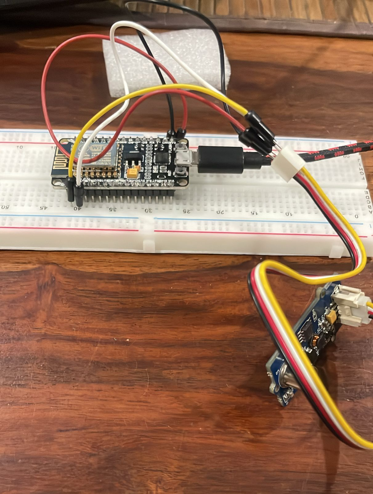

# AQ Sensor

Collect air quality information and serve it to Google Sheets.

## Hardware
1. [Grove Air Quality Sensor v1.3](https://robu.in/product/grove-air-quality-sensor-v1-3/)
2. [ESP8266 Node-MCU Board]((https://randomnerdtutorials.com/getting-started-with-esp8266-wifi-transceiver-review/))

## Software
1. `code.gs` - Backend - Google Apps Script
2. `aqsensor.ino` - to send data to Google Sheets from ESP8266

## Workflow

1. Create a Google Sheet. Note it's SheetID. Create a Google AppScript with `code.gs` code. I referred to this video for help: [Sending data to google sheet from ESP8266](https://www.youtube.com/watch?v=okNECYf2xlY)

2. Deploy the AppScript as a WebApp. It creates an endpoint to ping. When you ping it with required paramters(variables), the google sheet will be updated accordingly.

3. In Arduino IDE: `aqsensor.ino`
    
    a) Setup should include sensor preparation and WiFI connection
    
    b ) Loop should include reading AQ sensor values and then pinging the endpoint created above.
    
<video id="myVideo" controls src="Googlesheets_updating.mp4" title="Title"></video>

Notes:
1. When AQ is a string, the google sheet is not getting updated. I don't understand why. When I manually ping the endpoint on browser with a string value for AQ, it works. For now I send AQ as 0,1,2,3 from ESP8266. 
2. I receive HTTP 302 response on pinging. Sheets is still getting updated.. so okay.