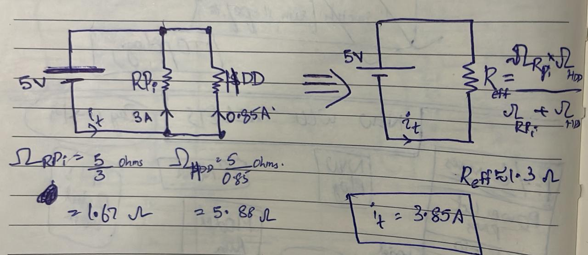
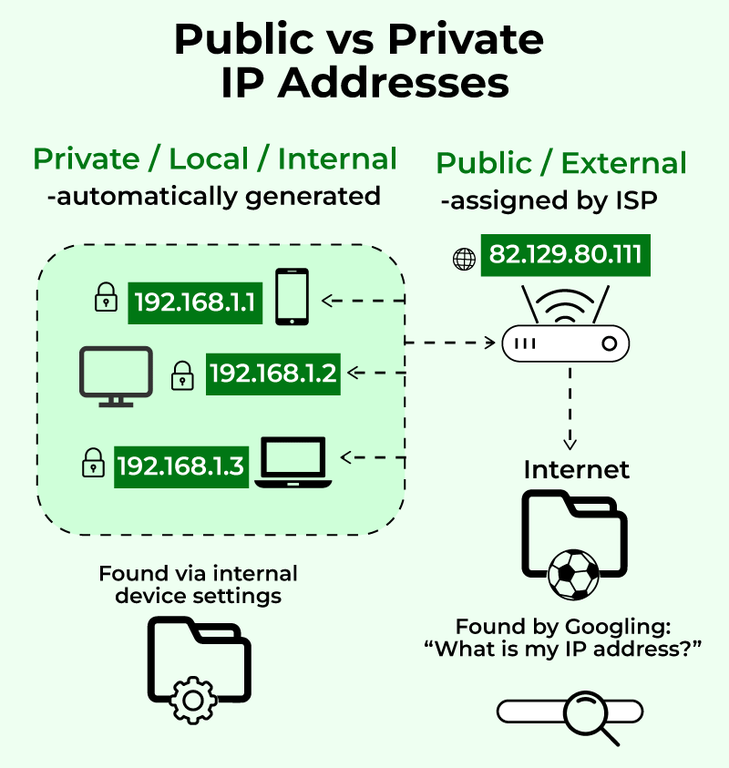

# IoT

I'm an absolute noob when it comes to hardware. I also have some phobia with it.

So, on Newyear 2024, I gifted myself a Raspberry Pi 4 Model B to overcome my phobia. [Robocraze](https://robocraze.com/products/raspberry-pi4-model-b-4gb-ultimate-kit-with-pi4-model-b-4gb-case-power-adapter-heatsink-fan-hdmi-cable-ethernet-cable-16gb-sd-card-sensors-and-manual) gave me the best deal for the entire kit. They're also one of the [authorised resellers](https://www.raspberrypi.com/resellers/?q=India&country=1) in India.

This seems like a good place to start learning: [Projects](https://projects.raspberrypi.org/en/projects?hardware%5B%5D=raspberry-pi)

### Jan 6, 2024:
Okay, I realise that I need other electrical components to do interesting project. But I can start with a few projects that don't need additional components. 

A few projects can be done on Raspberry Pico. But what is it?

Pico(Arduino) is a micro-controller based while Pi is a micro-processor based. I don't know the different between the both either.


| Raspberry Pi    | Pico/Arduino |
| -------- | ------- |
| Entire Computer in itself  | More like a calculator    |
| Micro-processor based | Micro-controller based     |
| Has OS and all software overheads    | No OS. It just runs the logic you code |
| Multiple tasks (like a computer)   | Runs one task at a time (like a calculator) |
| Electrical components attached should have ~3V   | Electrical components attached can have 5V |
| Python, C, Java etc  | C, C++|
| More power  | Less power |
| Costly  | Cheap |

### Jan 8, 2024:

I read on Raspberry Pi's User Guide that it requires a 5V, 3A charger. What if I use another charger? This question pushed me into a rabit hole of high school physics of electricity.

Let's start with lightning. Because electricity was discovered there (Benjamin Franklin's kite experiment)

This is how a lightning generally occurs. Clouds have negative charge. Ground has positive charge. But there is air in between. And air is an insulator (high resistance). Meaning, it has few charged particles whose movement is required for a current flow. So you won't see a lightning often.

But, as the negative charge builds up in clouds, the electric potential between cloud and ground keeps increasing (let's call that Voltage is increasing). As voltage continously increases to one point, the particles of air gets ionised and now air has more charged particles. Air thus became a conductor and provides a pathway (like a wire) for the electrons. That pathway is the lightning. This breakdown of air (any insulator) from being a resistor to a conductor is called Electric breakdown.


As electrons flow rapidly, they collide with atoms in the way. This collission (Kinetic Energy) heats up the air, apparently upto some 50,000 degrees. Various gas atoms are excited at that temperature giving the color you see.

Now, say you put a electric bulb in this lightning strike pathway :) You can light that bulb using this natural phenomenon. This is like putting a turbine in the path of flowing water and generating mechanical energy.

But there is a problem. There are so many electrons flowing in the lightning strike that air (bad conductor again) itself got heated. Your electric bulb will die as it cannot handle such high current (current = flow of charge/electrons). So you want to reduce or regulate current?

After doing a lot of experiments, Georg Ohm discovered that to reduce current you have to reduce Voltage or increase resistance. Air is already one of the highest resistance substances. You cannot find a bulb with more resistance than that. So you have to reduce voltage. I don't think you can do it between clouds and ground (you'll probably get a Nobel Prize if you can do it). But Alessandro Volta had created a [battery](https://www.youtube.com/watch?v=9OVtk6G2TnQ) with lesser voltage.

Now, instead of putting your bulb in between the cloud-burn circuit (and burning it), you can put in a circuit with the battery. But, this battery hass less voltage - air is back to being an insulator. So instead of air, find some other material that can work as a conductor with this less voltage battery. Copper wires! Being metals, they have a lot of charged particles that can provide the pathway for electrons from negative side of the battery to positive side of the battery.

Back to Raspberry Pi.

5V, 3A means that the Pi needs 3 Amperes of current across a 5 Volts difference across it. I think it has a 1.67 Ohms resistance. So, when connected to a 5V power supply, it can draw 3 Amperes of current. You just have to ensure that your 5V charger can safely give 3A current.
1. Don't think about using a charger with higher voltage rating like 9V. With 1.67 Ohms load, Pi will draw some 5.4A current (when it only requires 3A). It would be damaged. If Lesser voltage rating (3V) then the Pi will draw less power than required.
2. 5V but higher Amperage, say 5A. Go ahead. Any way, your Pi will draw 3A only based on its resistance. Less amperage, your Pi might not switch on or slow down.


### Jan9, 2024

Have to choose OS today for my Pi. Used the recommended 64 bit Raspberry Pi OS. Can explore Ubuntu and others as well.

Connected Pi to TV via HDMI. The Pi will use TV's audio system - HDMI0 -> HDMI2 

If I use my Pi as a server, how much will it cost me? It's a 15W device. So, if I use it 24*7, I'll consume 15*30*24/100 kwh = (10.8 kWh)

### Jan10, 2024

I SSHed into Pi today. It's easy when you can connect your Pi to the monitor and see its ipaddress ```ifconfig```. I SSHed first this way.

But then what if I take my Pi somewhere where there is no monitor? How will I know the IP of my Pi?

1. Note down the MAC address: d8:3a:dd:7d:18:53 of your Pi
2. Open Router Interface. I have JioFiber - [192.168.29.1](192.168.29.1) and login.
3. Check you W/LAN Clients and find the MAC address of your Pi. You'll see a IPv4 or IPv6 address. Use it to ssh into your Pi!

Deployed my SamvidhanBot on Pi.
1. Raspbian Pi OS has git and Python pre-installed. `sudo apt install virtualenv` to install virtuanenv. (On local you can do `sudo pip install virtualenv`)

### Jan11, 2024

Learnt to run a shell script on startup of my RPi. `crontab @reboot` method did not work I don't know why.

        sudo nano /etc/rc.local
        # Add the following before exit 0
        /bin/bash /path/to/your/script.sh

rc.local file is the file that the Linux system runs on startup. So if you include a script there, it will also run on startup.

### Jan 13, 2024

Nithish Gnani suggested that I build a NAS (Network attached storage) using RPi. Basically its my own cloud storage. I have a few old harddisks which I can re-purpose for this. [Here's a good tutorial](https://www.pcmag.com/how-to/how-to-turn-a-raspberry-pi-into-a-nas-for-whole-home-file-sharing).

That tutorial messed up something when I edited the `/mnt/etc/fstab` file. Herwig's comment in this [blog](https://www.htgsd.com/information-technology/fix-rpi-with-cannot-open-access-to-console-the-root-account-is-locked/) helped me resolve. Should try NAS again later.

### Jan 14, 2024
NAS. People suggest that we have to use a powered USB hub to power the External harddisk. But why? You can connect your HDDs directly to your system right?



So when we connect HDD to the RPi, it is basically a parallel connection (HDD also needs 5V*0.85A power supply). As a result, the overall current in the circuit increases to 3.85A

But my RPi charger was designed for 5V*3A. This is an instance of current overload. If I connect more HDDs, overload will be bigger and that might cause an issue. I've to get a powered US Hub if I plan to host a NAS server 24/7. 

NAS is working on my local. I've to learn port forwarding to make my Pi and NAS available over internet now.

### Jan 15, 2024



Carrier-Grade Network Address Translation (CGNAT): Jio Fiber uses CGNAT. So I cannot do port forwarding by simply logging into router and opening ports.

Generally (NAT) ISPs provide you one public IP (assigned to the router) to which your private devices can connect to. But in CGNAT, multiple customers (routers) are given one public IP. CGNAT came up because of IPv4 addresses shortage.

Then came IPv6 addresses. These are abundant. So many that each device connected to internet get one. They might not be static though (you will have to buy one so). Anyways, IPv6 addresses help you connect to the internet (they are public).

Used these IPv6 addresses to do port forwarding on Jio Fiber.

Completed building a NAS with RPi. Files can be accessed with SFTP.

### May 29, 2024

Coming after a long break. I'd been to Bangalore last weekend where I met [Balu Babu](https://x.com/AskBaluBabu), an hardware geek. He is responsible for me reopening this again.

I did my first electronics project! **A blinking LED with a morse code twist!** Morse code because I just cleared HAM Radio License exam last week :)

The code for it is in `Projects/led_morse.py`

Decode this
<video controls src="assets/world.mp4" title="Hello World - Morse LED"></video>

This [video](https://www.youtube.com/watch?v=CL39xCXdU64) helped me a lot in doing this.

### May 31, 2024

I worked on push buttons. I did a mistake not knowing how GPIO pins exactly work.I connected the push button and the LED to the same GPIO pin. And then I wanted the GPIO to also receive input from the button apart from giving output to the LED. Not right. I used two pins (one pin receives input from button; other powers the LED) and now I get what I want -- Button toggling LED light.

<video controls src="assets/button_led.mp4" title="Button - LED"></video>

The code for it is in `Projects/button_led.py`

Learnt about debouncing push buttons. Basically, due to the mechanical vibrations involved GPIO may read one push as several pushes. So yove select a timeframe in which any number of recorded pushes are treated as one push. 

I don't think all pins output voltage by default. When I connect LED to a GPIO Pin, it would glow only when I give output via code. However, my GPIO2 is constantly giving out voltage. LED is glowing but very dimly. Not sure if its a feature or a bug. Shreekumar said that it is because GPIO2 pin is I2C and has low internal pull-up resistor (thus giving out a high voltage out default).

### June 3, 2024

I built a Morse Code transmitter with an active buzzer and a PNP transistor. This [resource](https://docs.sunfounder.com/projects/superkit-v3-pi/en/latest/Lesson_6_buzzer.html) was helpful for code. Tutorials were generally suggesting the buzzer be connected to the 5V pin and the base of the transistor be connected to a GPIO pin of 3.3V. But I faced a problem with this - even when the GPIO OUT (to transistor) is HIGH, the transistor is still forward biased and there is a feeble beep. So I connected the buzzer to 3.3V pin. Now, when the GPIO OUT is HIGH, the transistor goes to reverse bias - no beep.

The code for it is in `Projects/morsetransmit.py`

 <video controls src="assets/morsebeep.mp4" title="Title"></video>