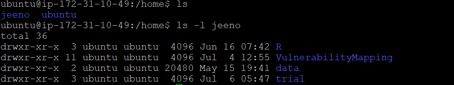
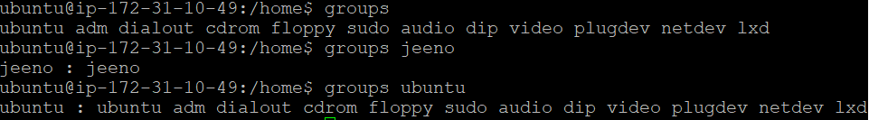
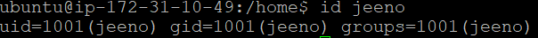

# Managing permissions on the device

> 💡 **drwxr-xr-x** and other cryptic permissions that allow you to manage your colleagues’ contributions on the server.

**What do these letters mean?**

1. **“d”** - tells you that this is a directory. If it's a file there would be a "-" instead.
2. The next three characters **(rwx)** tell us what the **owner** can do on this directory. **r**ead, **w**rite and e**x**ecute. If any permission is not present, we see a **“-”** there. Currently, the owner has all r,w,x permissions on the directory.
3. The next three characters **(r-x)** tell us what the **group members** can do. Currently, group members can read and execute, but cannot write.
4. The final three characters **(r-x)** are permissions for everybody else.

**The natural question to ask is, who are the owners, group members, and others of a directory?**

1. Just type **“ls -l path/to/directory” —** the third field is the owner, fourth is the group.
    
    
    
    “**ubuntu”** username is the owner of the directory **“jeeno”. “ubuntu”** group has group ownership.
    
2. Type **“groups”** to see all the groups existing on the server. **“groups [username]”** to see the groups to which the username belongs to
    
    
    
    **jeeno** username belongs to the **jeeno** group**. ubuntu** username belongs to a lot of groups.
    
    
    
3. Others are simply all other users who are not in the group.

***

Q1. How to **ch**ange the **own**ership of a directory?

A. We use **“chown”** command to change ownership, at both username and group level.

        sudo chown -R [username of new owner]:[group of new owner] [directory/file]
*-R: ensures that the change in ownership applies to all the files and folders inside the directory. You can also leave [username] or [group] blank if you don’t want to touch those permissions*

*** 
Q2. How to change permission rights?

A. We use **“chmod”** command to change the permission rights of users, groups and others on a directory.

        chmod u+x welcome.sh
*This gives you, the **u**ser, permission to run (e**x**ecute) this file as a command.*
